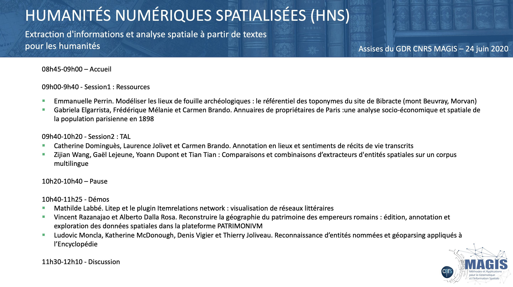

Meeting of the '[Digital Spatial Humanities](https://projet.liris.cnrs.fr/aphns-magis/)' working group of the [GDR CNRS MAGIS](http://gdr-magis.imag.fr/).

Organized by [Ludovic Moncla](https://ludovicmoncla.github.io) and 
[Carmen Brando](http://crh.ehess.fr/index.php?5088)

